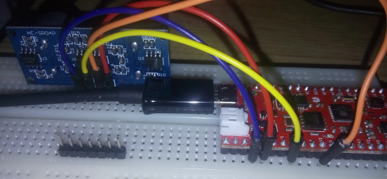

#Ultrasonic 3.3V sensor with ESP32

I got an ultrasonic sensor that actually works with 3.3V VCC.
Note that a normal HC-SR04 sensor will not work. It requires 5V Vcc.
If you want to use it is vital to reduce the echo to 3.3V for input.

This sensor, however actually works on only 3.3V

https://www.aliexpress.com/item/HC-SR04P-Ultrasonic-Ranging-Module-Ranging-Sensor-Module-3-5-5V-Wide-Voltage-Performance-Is-Stronger/32711959780.html


I hooked it up to my ESP32 thing.

I use pin 4 as echo and 15 as trig.
  #define ECHO_PIN GPIO_NUM_4
  #define TRIG_PIN GPIO_NUM_15


https://www.sparkfun.com/products/13907



#platformio
I tried this ide for the project.
https://github.com/Ebiroll/qemu_esp32/blob/master/platformio.md


#Max sonar sensor.

http://www.maxbotix.com/documents/HRLV-MaxSonar-EZ_Datasheet.pdf

Later I will use the TTL uart interface. But as starting point I will use the analog-voltage pin.
On my sensor it should output a value of (Vcc*2/1024) per 10 mm.
Vdist = dist * 3.3*2/*1024        in cm
dist=Vdist*1024.0/6.6
```

ESP_ERROR_CHECK(adc1_config_width(ADC_WIDTH_12Bit));
ESP_ERROR_CHECK(adc1_config_channel_atten(ADC1_CHANNEL_7, ADC_ATTEN_0db));

int times=10;
while (times-->0) {
   vTaskDelay(1000 / portTICK_PERIOD_MS);
   unsigned int val=adc1_get_voltage(ADC1_CHANNEL_7);
        printf("ADC value : %d\n",val );
        double distance = 1024.0*val/6.6;    // mm
        printf("Distance: %f cm\n",distance/10000.0 );

}
```
Not very successful. Instead I soldered the TTL jumper on the back of the sensor.
Connected PIN 7-GND to gnd. PIN 6 to vcc 3.3V and PIN5 Serial output to pin 2 of the ESP32.
There was problems flashing the software but when disconntcting PIN 2 during flashing. It worked fine.
See  for the results and compare when moving sesnor backwards 10mm each time.
The sensor transmits R0123^M 2 times every second.

```
  while(1) {
    while (data[0]!='R') {
         len=uart_read_bytes(uart_num, data, 1, 100 / portTICK_RATE_MS);
     }
     len = uart_read_bytes(uart_num, data, 4, 500 / portTICK_RATE_MS);
     if (len==4) {
         data[len]=0;
         //data[len+1]=0;
         printf("got %d:%s\n",len,data);
     }
  }
```


#Start qemu

Todo, measure time with xos_get_system_cycles()

To start firmware.elf built by platformio

```
> xtensa-esp32-elf-gdb .pioenvs/esp32thing/firmware.elf -ex 'target remote:1234'

> xtensa-softmmu/qemu-system-xtensa -d guest_errors,unimp  -cpu esp32 -M esp32 -m 4M   -net nic,model=vlan0 -net user,id=simnet,ipver4=on,net=192.168.1.0/24,host=192.168.1.40,hostfwd=tcp::10023-192.168.1.3:23  -net dump,file=/tmp/vm0.pcap  -kernel  ~/esp/esp32_ultra/.pioenvs/esp32thing/firmware.elf  -s -S  > io.txt
```

---------------

When running in qemu, the following ports are accessed.

```
    gpio_pad_select_gpio(ECHO_PIN);
    gpio_pad_select_gpio(TRIG_PIN);


  io read 49048
  io write 49048,2000
  io read 4903c
  io write 4903c,2000
```


---------------

```
    gpio_set_level(TRIG_PIN, 1);
    vTaskDelay(100 / portTICK_PERIOD_MS);
    gpio_set_level(TRIG_PIN, 0);
    uint32_t startTime=get_usec();

  io write 4903c,0
  io write 44024,8000
  io read 440c4
  io write 440c4,0
  io read 49048
  io write 49048,200
  io write 44028,10
  io read 44098
  io write 44098,0
```

```
Example boot
rst:0x1 (POWERON_RESET),boot:0x13 (SPI_FAST_FLASH_BOOT)
configsip: 0, SPIWP:0x00
clk_drv:0x00,q_drv:0x00,d_drv:0x00,cs0_drv:0x00,hd_drv:0x00,wp_drv:0x00
mode:DIO, clock div:2
load:0x3ffc0008,len:0
load:0x3ffc0008,len:1964
load:0x40078000,len:3668
load:0x40080000,len:260
entry 0x40080034

```
